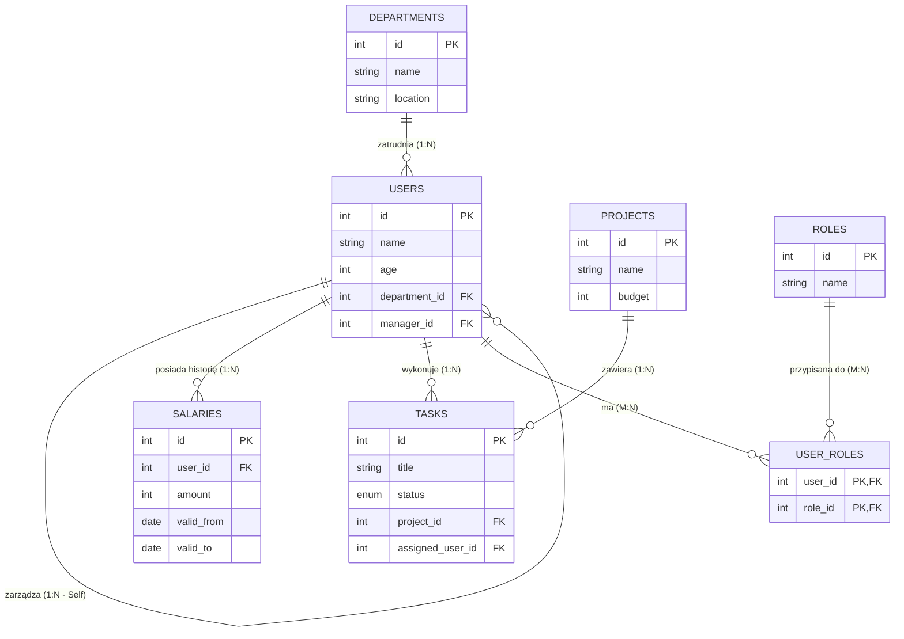

# Wstęp

Niniejsza dokumentacja opisuje projekt relacyjnej bazy danych wspierającej zarządzanie strukturą organizacyjną firmy oraz realizacją projektów. Model bazy danych umożliwia przechowywanie informacji o pracownikach, działach, rolach, projektach, zadaniach oraz wynagrodzeniach.

# Diagram ER

# Encje

Opisanie struktury encji, przeznaczenie encji i ich relacji.

### 1. Users (pracownik)

Encja `users` przechowuje dane pracowników firmy. Oprócz podstawowych informacji, takich jak imię i wiek, zawiera klucze obce wskazujące dział oraz menedżera pracownika

**Schema:** 
- `id` SERIAL PRIMARY KEY
- `name` TEXT NOT NULL
- `age` INT
- `department_id` INT  FK → `departments(id)` (opcjonalny)
- `manager_id` INT  FK → `users(id)` (self‑reference, opcjonalny)
---
### 2. user_roles (Powiązanie użytkownik <-> rola)

Encja `user_roles` jest tabelą pośrednią realizującą relację wiele-do-wielu pomiędzy encjami `users` i `roles`. Umożliwia przypisanie jednemu użytkownikowi wielu ról oraz jednej roli wielu użytkownikom. Klucz główny złożony zapobiega duplikacji przypisań.

**Schema:** 
- `user_id` INT FK → `users(id)`
- `role_id` INT FK → `roles(id)`
- PRIMARY KEY (`user_id`, `role_id`) (wiele-do-wielu)
---
### 3. roles

Encja `roles` opisuje role organizacyjne, jakie mogą pełnić pracownicy. Każda rola posiada unikalną nazwę. Encja ta umożliwia elastyczne zarządzanie uprawnieniami i funkcjami użytkowników w organizacji.

**Schema:** 
- `id` SERIAL PRIMARY KEY
- `name` TEXT NOT NULL UNIQUE
---

### 4.  deparaments

Encja `departments` reprezentuje działy organizacyjne w firmie. Przechowuje nazwę działu oraz jego lokalizację. Jeden dział może być powiązany z wieloma pracownikami, jednak usunięcie działu nie powoduje usunięcia pracowników, a jedynie usunięcie przypisania do działu.

**Schema:** 
- `id` SERIAL PRIMARY KEY
- `name` TEXT NOT NULL
- `location` TEXT
---

### 5. salaries
 
Encja `salaries` służy do przechowywania historii wynagrodzeń pracowników. Każdy rekord określa wysokość wynagrodzenia oraz okres jego obowiązywania(umowy). Takie rozwiązanie umożliwia analizę zmian wynagrodzeń w czasie i zachowanie danych historycznych.

**Schema:** 
- `id` SERIAL PRIMARY KEY
- `user_id` INT FK → `users(id)`
- `amount` INT NOT NULL
- `valid_from` DATE NOT NULL
- `valid_to` DATE (NULL = bieżąca/aktualna)
---

### 6. tasks 

Encja `tasks` przechowuje informacje o zadaniach realizowanych w ramach projektów. Każde zadanie posiada tytuł, status realizacji oraz powiązanie z projektem. Zadania mogą być przypisane do użytkownika, jednak przypisanie to jest opcjonalne.

**Schema:** 
- `id` SERIAL PRIMARY KEY
- `title` TEXT NOT NULL
- `status` TEXT  CHECK IN ('todo','in_progress','done')
- `project_id` INT  FK → `projects(id)`
- `assigned_user_id` INT  FK → `users(id)` (opcjonalne)
---
### 7. projects  

Encja `projects` przechowuje informacje o projektach realizowanych w firmie. Zawiera podstawowe dane identyfikacyjne projektu, takie jak nazwa oraz budżet. Każdy projekt może składać się z wielu zadań, co pozwala na szczegółowe planowanie i kontrolę realizacji prac.

**Schema:** 
- `id` SERIAL PRIMARY KEY
- `name` TEXT NOT NULL
- `budget` INT
# Scenariusze analitycznego wykorzystania

### 1. Lista użytkowników wraz z nazwami ich działów i menedżerów

Cel: Zidentyfikowanie, którzy pracownicy należą do jakiego działu i kto jest ich bezpośrednim przełożonym. To zapytanie jest kluczowe dla struktury organizacyjnej i raportowania HR.

Analiza: Pozwala na szybkie zorientowanie się w hierarchii firmy i przypisaniu pracowników.

    SELECT
        u.name AS "Nazwa Uzytkownika",
        d.name AS "Nazwa Dzialu",
        m.name AS "Menedzer"
    FROM
        users u
    LEFT JOIN
        departments d ON u.department_id = d.id
    LEFT JOIN
        users m ON u.manager_id = m.id
    ORDER BY
        "Nazwa Dzialu", "Nazwa Uzytkownika";

### 2. Średnie wynagrodzenie w każdym dziale

Cel: Obliczenie średniego wynagrodzenia dla każdego działu, biorąc pod uwagę tylko aktualne pensje. Jest to kluczowe dla analizy kosztów pracy.

Analiza: Pozwala na porównanie poziomu wynagrodzeń między działami.

    SELECT
        d.name AS "Nazwa Dzialu",
        AVG(s.amount) AS "Srednie Wynagrodzenie"
    FROM
        departments d
    JOIN
        users u ON d.id = u.department_id
    JOIN
        salaries s ON u.id = s.user_id
    WHERE
        s.valid_to IS NULL
    GROUP BY
        d.name
    ORDER BY
        "Srednie Wynagrodzenie" DESC;

### 3. Projekty i liczba przypisanych do nich zadań wraz z ich statusami

Cel: Uzyskanie przeglądu postępu prac nad poszczególnymi projektami poprzez zliczenie zadań i ich statusów.

Analiza: Pomaga w ocenie obciążenia projektów, efektywności zarządzania projektem.

    SELECT
        p.name AS "Nazwa Projektu",
        t.status AS "Status Zadania",
        COUNT(t.id) AS "Liczba Zadan"
    FROM
        projects p
    LEFT JOIN
        tasks t ON p.id = t.project_id
    GROUP BY
        p.name, t.status
    ORDER BY
        p.name, t.status;

### 4. Liczba użytkowników na każdą rolę

Cel: Zliczenie, ilu użytkowników pełni każdą z zdefiniowanych ról. Pomaga to w zrozumieniu rozkładu obowiązków i specjalizacji w organizacji.

Analiza: To zapytanie dostarcza informacji o wielkości zespołów przypisanych do poszczególnych ról. Może być użyte do oceny, czy zasoby są odpowiednio rozdzielone i czy nie ma zbyt wielu lub zbyt mało osób na kluczowych stanowiskach.

    SELECT
        r.name AS "Nazwa Roli",
        COUNT(ur.user_id) AS "Liczba Uzytkownikow"
    FROM
        roles r
    LEFT JOIN
        user_roles ur ON r.id = ur.role_id
    GROUP BY
        r.name
    ORDER BY
        "Liczba Uzytkownikow" DESC;

### 5. Użytkownicy z wynagrodzeniem powyżej średniej w swoim dziale

Cel: Zidentyfikowanie użytkowników, których aktualne wynagrodzenie jest wyższe niż średnie wynagrodzenie w ich dziale.

Analiza: To zapytanie jest przydatne do monitorowania struktury wynagrodzeń, identyfikacji wyróżniających się pracowników pod kątem zarobków.

    WITH DepartmentAverage AS (
        SELECT
            d.id AS department_id,
            AVG(s.amount) AS avg_dept_salary
        FROM
            departments d
        JOIN
            users u ON d.id = u.department_id
        JOIN
            salaries s ON u.id = s.user_id
        WHERE
            s.valid_to IS NULL
        GROUP BY
            d.id
    )
    SELECT
        u.name AS "Nazwa Uzytkownika",
        d.name AS "Nazwa Dzialu",
        s.amount AS "Aktualne Wynagrodzenie",
        da.avg_dept_salary AS "Srednie Wynagrodzenie w Dziale"
    FROM
        users u
    JOIN
        salaries s ON u.id = s.user_id
    JOIN
        departments d ON u.department_id = d.id
    JOIN
        DepartmentAverage da ON d.id = da.department_id
    WHERE
        s.valid_to IS NULL AND s.amount > da.avg_dept_salary
    ORDER BY
        d.name, s.amount DESC;
