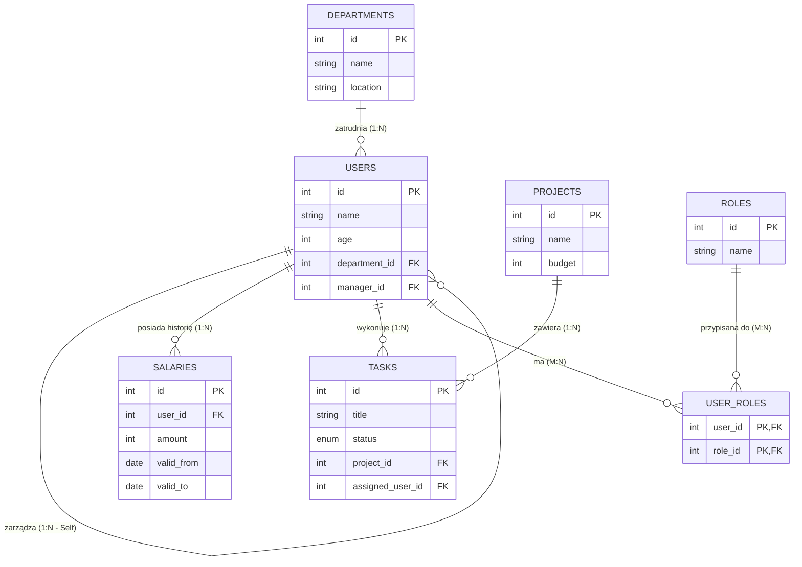

# Wstęp

Niniejsza dokumentacja opisuje projekt relacyjnej bazy danych wspierającej zarządzanie strukturą organizacyjną firmy oraz realizacją projektów. Model bazy danych umożliwia przechowywanie informacji o pracownikach, działach, rolach, projektach, zadaniach oraz wynagrodzeniach.

# Diagram ER

# Encje

Opisanie struktury encji, przeznaczenie encji i ich relacji.

### 1. Users (pracownik)

Encja `users` przechowuje dane pracowników firmy. Oprócz podstawowych informacji, takich jak imię i wiek, zawiera klucze obce wskazujące dział oraz menedżera pracownika

**Schema:** 
- `id` SERIAL PRIMARY KEY
- `name` TEXT NOT NULL
- `age` INT
- `department_id` INT  FK → `departments(id)` (opcjonalny)
- `manager_id` INT  FK → `users(id)` (self‑reference, opcjonalny)
---
### 2. user_roles (Powiązanie użytkownik <-> rola)

Encja `user_roles` jest tabelą pośrednią realizującą relację wiele-do-wielu pomiędzy encjami `users` i `roles`. Umożliwia przypisanie jednemu użytkownikowi wielu ról oraz jednej roli wielu użytkownikom. Klucz główny złożony zapobiega duplikacji przypisań.

**Schema:** 
- `user_id` INT FK → `users(id)`
- `role_id` INT FK → `roles(id)`
- PRIMARY KEY (`user_id`, `role_id`) (wiele-do-wielu)
---
### 3. roles

Encja `roles` opisuje role organizacyjne, jakie mogą pełnić pracownicy. Każda rola posiada unikalną nazwę. Encja ta umożliwia elastyczne zarządzanie uprawnieniami i funkcjami użytkowników w organizacji.

**Schema:** 
- `id` SERIAL PRIMARY KEY
- `name` TEXT NOT NULL UNIQUE
---

### 4.  deparaments

Encja `departments` reprezentuje działy organizacyjne w firmie. Przechowuje nazwę działu oraz jego lokalizację. Jeden dział może być powiązany z wieloma pracownikami, jednak usunięcie działu nie powoduje usunięcia pracowników, a jedynie usunięcie przypisania do działu.

**Schema:** 
- `id` SERIAL PRIMARY KEY
- `name` TEXT NOT NULL
- `location` TEXT
---

### 5. salaries
 
Encja `salaries` służy do przechowywania historii wynagrodzeń pracowników. Każdy rekord określa wysokość wynagrodzenia oraz okres jego obowiązywania(umowy). Takie rozwiązanie umożliwia analizę zmian wynagrodzeń w czasie i zachowanie danych historycznych.

**Schema:** 
- `id` SERIAL PRIMARY KEY
- `user_id` INT FK → `users(id)`
- `amount` INT NOT NULL
- `valid_from` DATE NOT NULL
- `valid_to` DATE (NULL = bieżąca/aktualna)
---

### 6. tasks 

Encja `tasks` przechowuje informacje o zadaniach realizowanych w ramach projektów. Każde zadanie posiada tytuł, status realizacji oraz powiązanie z projektem. Zadania mogą być przypisane do użytkownika, jednak przypisanie to jest opcjonalne.

**Schema:** 
- `id` SERIAL PRIMARY KEY
- `title` TEXT NOT NULL
- `status` TEXT  CHECK IN ('todo','in_progress','done')
- `project_id` INT  FK → `projects(id)`
- `assigned_user_id` INT  FK → `users(id)` (opcjonalne)
---
### 7. projects  

Encja `projects` przechowuje informacje o projektach realizowanych w firmie. Zawiera podstawowe dane identyfikacyjne projektu, takie jak nazwa oraz budżet. Każdy projekt może składać się z wielu zadań, co pozwala na szczegółowe planowanie i kontrolę realizacji prac.

**Schema:** 
- `id` SERIAL PRIMARY KEY
- `name` TEXT NOT NULL
- `budget` INT
